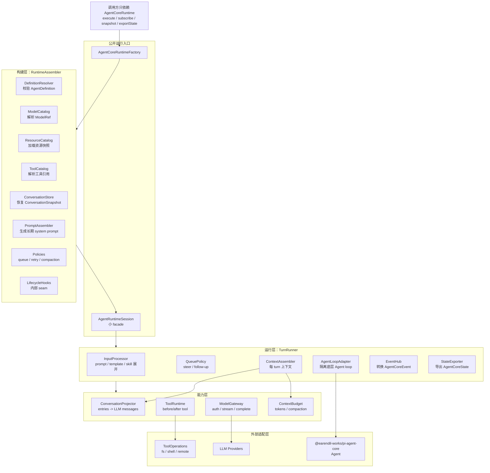

# Agent Core Harness 架构设计

## 1. 设计范围

本文只设计 `agent-core`。不考虑 client，不考虑 server，不沿用本仓库既有 agent 设计文档。

输入依据只有两类：

- Pi 三份设计文档：
  - `architecture-zh.md`
  - `harness-design-zh.md`
  - `createAgentSession-flow-zh.md`
- Pi 源码：
  - `workspace/pi/packages/coding-agent/src/core`

设计目标是收敛一套属于我们的 `agent-core` Harness：它可以创建一个 Agent 运行时，执行 prompt/steer/follow-up/abort，管理工具、模型、上下文、会话状态、压缩和生命周期扩展点，并对外暴露小而稳定的 interface。

## 2. 从 Pi Core 提取的判断

Pi 的 `src/core` 实际上有两个层次：

```text
createAgentSession / createAgentSessionServices
  -> 构建阶段：cwd 绑定服务、模型、资源、工具、Pi Agent

AgentSession
  -> 运行阶段：prompt、队列、事件、持久化、工具钩子、压缩、重试、扩展
```

关键源码节点：

| Pi 节点 | 说明 | 我们吸收的设计 |
| --- | --- | --- |
| `sdk.ts#createAgentSession` | 创建模型、恢复状态、创建 Pi `Agent`、注入 provider stream | 拆成 `RuntimeAssembler`，不让 runtime facade 直接装配所有东西 |
| `agent-session.ts#AgentSession` | 共享会话 facade，承载运行时行为 | 保留小 facade，但把内部能力拆成多个深模块 |
| `agent-session-services.ts` | cwd 绑定服务集合 | 我们需要 `AgentCoreServices`，作为 runtime 构建输入 |
| `agent-session-runtime.ts` | 会话切换时重建 cwd-bound services | 我们先不做 session switching，但保留“服务随 workspace/cwd 重建”的概念 |
| `resource-loader.ts` | 统一加载 context files、skills、prompts、extensions、system prompt | 设计 `ResourceCatalog`，产出可装配资源快照 |
| `system-prompt.ts` | system prompt 由工具、项目上下文、技能等拼装 | 设计 `PromptAssembler`，但区分长期 prompt 和 turn context |
| `session-manager.ts` | append-only tree + context projection | 设计 `ConversationStore` + `ConversationProjector` |
| `extensions/types.ts` + `runner.ts` | 宽扩展 API 和生命周期事件 | 先做内部 `LifecycleHooks`，不急着公开插件 API |
| `tools/index.ts` + `tool-definition-wrapper.ts` | ToolDefinition 和 AgentTool 桥接 | 设计 `ToolCatalog` + `ToolRuntime` |
| `compaction/` | token 估算、切点、摘要、恢复上下文 | 设计 `ContextBudget` + `CompactionPolicy` |
| `model-registry.ts` | 模型目录、认证、provider 注册 | 设计 `ModelCatalog` + `ModelGateway` |

Pi 给我们的主要启发不是“功能照搬”，而是几个清晰 seam：

- 构建 runtime 与执行 turn 分离。
- 会话历史存储与 LLM context 投影分离。
- tool 声明、tool 激活、tool 执行适配分离。
- system prompt 与每轮临时 context 分离。
- provider/model/auth 与 Agent loop 分离。
- lifecycle hooks 放在 Agent loop 周围，而不是散落到调用方。

## 3. 顶层形态

整体分层架构：



`agent-core` 对外只暴露一个小 interface：

```ts
type AgentCoreRuntime = {
  execute(command: AgentCommand): Promise<AgentRunOutcome>;
  subscribe(listener: AgentEventListener): () => void;
  snapshot(): AgentRuntimeSnapshot;
  exportState(): AgentCoreState;
  dispose(): Promise<void>;
};

type AgentCoreRuntimeFactory = {
  create(input: AgentRuntimeCreateInput): Promise<AgentCoreRuntime>;
};
```

调用方只需要知道：

- 用什么 `AgentDefinition` 创建 runtime。
- 用什么 `AgentCoreState` 恢复 runtime。
- 发送什么 `AgentCommand`。
- 监听什么 `AgentCoreEvent`。

调用方不需要知道：

- prompt 如何拼。
- tool 如何从 name 解析成可执行对象。
- provider API key 如何解析。
- conversation entries 如何投影成 LLM messages。
- compaction 如何选择切点。
- retry 如何决定是否继续。

顶层内部结构：

```text
AgentCoreRuntimeFactory
  -> RuntimeAssembler
     -> DefinitionResolver
     -> ModelCatalog / ModelGateway
     -> ResourceCatalog
     -> PromptAssembler
     -> ToolCatalog / ToolRuntime
     -> ConversationStore / ConversationProjector
     -> ContextBudget / CompactionPolicy
     -> LifecycleHooks
  -> AgentRuntimeSession
     -> TurnRunner
     -> EventHub
     -> StateExporter
```

其中 `AgentRuntimeSession` 是对外 runtime facade；复杂实现藏在内部模块里。

## 4. 核心数据模型

### 4.1 AgentDefinition

`AgentDefinition` 表达长期稳定的 agent 身份和能力引用。

```ts
type AgentDefinition = {
  id: string;
  model: ModelRef;
  instructions: AgentInstructions;
  tools: ToolRef[];
  resources?: ResourceRef[];
  policies?: AgentPolicyRef[];
};
```

约束：

- `id` 是恢复状态兼容性的一部分。
- `model` 是引用，不要求调用方传具体 provider 实例。
- `tools` 是 name/ref，不持有 tool object。
- `instructions` 只表达长期行为约束，不塞入临时文件内容、技能正文或历史摘要。
- `resources` 和 `policies` 可以后续加入，第一版不要放空字段污染 interface。

### 4.2 AgentCommand

参考 Pi 的 `prompt / steer / followUp / abort`，保留四类命令：

```ts
type AgentCommand =
  | { type: "prompt"; text: string; attachments?: AgentAttachment[] }
  | { type: "steer"; text: string; attachments?: AgentAttachment[] }
  | { type: "follow-up"; text: string; attachments?: AgentAttachment[] }
  | { type: "abort" };
```

语义：

- `prompt`：空闲时启动一次完整 Agent run。
- `steer`：运行中注入当前 run 的下一轮，优先于 follow-up。
- `follow-up`：当前工作自然结束后继续。
- `abort`：取消当前模型流、工具执行、retry、compaction。

### 4.3 AgentCoreState

`AgentCoreState` 是可恢复工作状态，不是永久审计日志。

```ts
type AgentCoreState = {
  schemaVersion: number;
  definitionId: string;
  modelRef: ModelRef;
  conversation: ConversationSnapshot;
  runtime?: {
    thinkingLevel?: ThinkingLevel;
    activeToolNames?: string[];
  };
};
```

恢复规则：

- `schemaVersion` 不支持则失败。
- `definitionId` 不匹配则失败。
- `modelRef` 不可用时走明确 fallback 策略，不能静默换模型。
- `conversation` 由 `ConversationStore` 解释，调用方不读取内部结构。

## 5. 模块设计

### 5.1 RuntimeAssembler

`RuntimeAssembler` 是创建 runtime 的深模块。

输入：

```ts
type RuntimeAssemblyInput = {
  definition: AgentDefinition;
  state?: AgentCoreState;
  services: AgentCoreServices;
};
```

输出：

```ts
type RuntimeAssembly = {
  definition: ResolvedAgentDefinition;
  model: AgentModel;
  thinkingLevel: ThinkingLevel;
  promptPlan: PromptPlan;
  activeTools: AgentTool[];
  conversation: ConversationRuntimeState;
  modelGateway: ModelGateway;
  lifecycle: LifecycleHooks;
  policies: RuntimePolicies;
};
```

职责：

- 校验 definition。
- 解析 model。
- 恢复 conversation。
- 决定初始 thinking level。
- 解析 active tools。
- 创建 prompt/context 装配计划。
- 连接 lifecycle hooks。
- 产出 `AgentRuntimeSession` 可以直接使用的运行态对象。

不做：

- 不执行 prompt。
- 不直接调用 LLM。
- 不执行 tool。

### 5.2 AgentRuntimeSession

`AgentRuntimeSession` 是对外 runtime facade，对应 Pi 的 `AgentSession`，但 interface 必须小。

职责：

- 接收 `AgentCommand`。
- 管理当前 run 状态。
- 把命令交给 `TurnRunner`。
- 对外发布 `AgentCoreEvent`。
- 导出 snapshot/state。
- dispose 时取消所有进行中的工作。

它不直接知道：

- resource 文件怎么找。
- system prompt 怎么拼。
- compaction 摘要怎么生成。
- tool name 怎么解析。

### 5.3 TurnRunner

`TurnRunner` 对应 Pi Agent loop 周围的运行编排。

执行流程：

```text
execute(prompt)
  -> InputProcessor
  -> QueuePolicy
  -> ContextAssembler.beforeRun()
  -> AgentLoopAdapter.run()
     -> model stream
     -> assistant events
     -> tool calls
     -> tool results
     -> next turn if needed
  -> RetryPolicy
  -> CompactionPolicy
  -> queued messages check
  -> finish
```

`TurnRunner` 负责“什么时候继续”，但不负责“上下文内容怎么生成”或“工具具体怎么执行”。

### 5.4 AgentLoopAdapter

这一层隔离底层 Agent loop。第一版可以直接适配 `@earendil-works/pi-agent-core` 的 `Agent`。

Interface：

```ts
type AgentLoopAdapter = {
  run(messages: AgentMessage[]): Promise<void>;
  continue(): Promise<void>;
  steer(message: AgentMessage): void;
  followUp(message: AgentMessage): void;
  abort(): void;
  waitForIdle(): Promise<void>;
  subscribe(listener: (event: AgentLoopEvent) => void): () => void;
  getState(): AgentLoopState;
  replaceMessages(messages: AgentMessage[]): void;
  setTools(tools: AgentTool[]): void;
  setContextProvider(provider: ContextProvider): void;
};
```

这样未来底层 loop 不是 Pi Agent 时，外部 `AgentRuntimeSession` 不需要变化。

### 5.5 PromptAssembler

Pi 的 `buildSystemPrompt()` 把默认提示词、工具、项目上下文、skills、日期、cwd 拼在一起。我们的设计要拆成两层：

```text
PromptAssembler
  -> long-lived system prompt

ContextAssembler
  -> per-turn context messages/materials
```

`PromptAssembler` 只负责长期约束：

- definition instructions。
- agent role。
- tool availability summary。
- stable policy text。

不放入：

- 当前读取的资源全文。
- skill 正文。
- memory recall。
- compaction summary。
- 某一轮用户临时上下文。

这些进入 `ContextAssembler`。

### 5.6 ResourceCatalog

参考 Pi 的 `DefaultResourceLoader`，但去掉 UI/theme/extension 生态负担。

第一版资源类型：

```ts
type ResourceSnapshot = {
  contextFiles: ContextFile[];
  skills: SkillDescriptor[];
  promptTemplates: PromptTemplate[];
  systemPromptOverride?: string;
  appendSystemPrompt?: string[];
  diagnostics: ResourceDiagnostic[];
};
```

职责：

- 按 workspace/cwd 加载资源。
- 返回不可变快照。
- 支持 reload。
- 记录 diagnostics，不直接打印、不退出进程。

重要约束：

- `ResourceCatalog` 不决定哪些资源进入本轮 LLM context。
- 它只发现和读取资源；选择权在 `ContextAssembler`。

### 5.7 ContextAssembler

`ContextAssembler` 是每 turn 的上下文装配中心。

输入：

```ts
type ContextAssemblyInput = {
  command: AgentCommand;
  definition: ResolvedAgentDefinition;
  conversation: ConversationRuntimeState;
  resources: ResourceSnapshot;
  activeTools: AgentTool[];
  budget: ContextBudget;
};
```

输出：

```ts
type TurnContext = {
  systemPrompt: string;
  messages: AgentMessage[];
  tools: AgentTool[];
  metadata: ContextMetadata;
};
```

职责：

- 从 conversation 投影当前 branch 的 messages。
- 注入 compaction summary / branch summary。
- 按需注入资源、技能、memory。
- 计算/尊重 context budget。
- 触发 `beforeContext` lifecycle hook。

这是后续 Memory、Skill、Resource、Compaction 的共同入口。

### 5.8 ConversationStore

Pi 的 `SessionManager` 最有价值的部分是 append-only entries 和 context projection。

我们的 `ConversationStore` 应抽象为：

```ts
type ConversationStore = {
  append(entry: ConversationEntry): ConversationEntryId;
  getEntry(id: ConversationEntryId): ConversationEntry | undefined;
  getEntries(): readonly ConversationEntry[];
  getCurrentPath(): readonly ConversationEntry[];
  branchFrom(id: ConversationEntryId): void;
  exportSnapshot(): ConversationSnapshot;
};
```

`ConversationEntry` 第一版：

```ts
type ConversationEntry =
  | MessageEntry
  | ModelChangeEntry
  | ThinkingLevelChangeEntry
  | CompactionEntry
  | CustomStateEntry;
```

设计原则：

- append-only，便于恢复、调试、测试。
- entry 有 `id` 和 `parentId`，即使第一版不暴露分支，也为后续保留结构。
- 不直接把所有 entries 发给 LLM。

### 5.9 ConversationProjector

单独负责把 conversation entries 投影成 LLM messages。

职责：

- 沿当前 leaf/path 收集 entries。
- 应用最新 compaction boundary。
- 把 `CompactionEntry` 转成 summary message。
- 跳过不进入 LLM 的 custom state。
- 保证 tool call/tool result 顺序合法。

这个模块是测试重点，因为它决定“模型实际看到什么”。

### 5.10 ToolCatalog

参考 Pi 的 `ToolDefinition -> AgentTool` 桥接。

```text
ToolCatalog
  -> ToolDefinition     面向 Harness 的声明
  -> ToolAdapter        面向底层 Agent loop 的桥接
  -> ToolRuntime        面向执行环境的运行策略
```

`ToolDefinition`：

```ts
type ToolDefinition = {
  name: string;
  description: string;
  parameters: JsonSchema;
  promptSnippet?: string;
  promptGuidelines?: string[];
  executionMode?: "parallel" | "sequential";
  execute: ToolExecute;
};
```

`ToolCatalog` 职责：

- 注册 tool definitions。
- 根据 `AgentDefinition.tools` 解析 active tools。
- 去重和冲突检查。
- 输出 prompt snippets/guidelines。
- 包装 lifecycle hooks：`beforeToolCall` / `afterToolCall`。

工具执行环境不要写死在 tool 里。文件系统、shell、远程环境应通过 `ToolOperations` 注入。

### 5.11 ModelCatalog 与 ModelGateway

Pi 的 `ModelRegistry` 同时处理模型目录、custom models、provider 注册、auth 解析。我们可以拆成两个模块：

```text
ModelCatalog
  -> 模型发现、模型引用解析、能力查询

ModelGateway
  -> 认证解析、provider request、stream 标准化
```

`ModelGateway` interface：

```ts
type ModelGateway = {
  stream(input: ModelStreamInput): Promise<AsyncIterable<ModelStreamEvent>>;
  complete(input: ModelCompleteInput): Promise<AssistantMessage>;
  resolveAuth(model: AgentModel): Promise<ModelAuthResult>;
};
```

`TurnRunner` 只依赖 `ModelGateway`，不读环境变量、不碰 auth storage。

### 5.12 LifecycleHooks

Pi 的扩展系统非常宽。我们的第一版只保留内部 hooks：

```ts
type LifecycleHooks = {
  onInput?(input: InputHookInput): Promise<InputHookResult>;
  beforeRun?(input: BeforeRunInput): Promise<BeforeRunResult>;
  beforeContext?(input: ContextHookInput): Promise<ContextHookResult>;
  beforeToolCall?(input: ToolCallHookInput): Promise<ToolCallHookResult>;
  afterToolCall?(input: ToolResultHookInput): Promise<ToolResultHookResult>;
  afterMessage?(input: MessageHookInput): Promise<MessageHookResult>;
  beforeCompaction?(input: CompactionHookInput): Promise<CompactionHookResult>;
  afterRun?(input: AfterRunInput): Promise<void>;
};
```

原则：

- 第一版是内部 seam，不开放插件 API。
- hook 返回值必须可组合，避免共享可变对象到处传。
- hook 错误要转成 runtime event 或 run failure，不能悄悄吞掉。
- 等 Memory、Skill、Permission、Subagent 真的出现，再把对应 hook 提升为可注册 adapter。

### 5.13 CompactionPolicy

Pi 的 compaction 有三个关键行为：

- 阈值触发。
- context overflow 后压缩并重试。
- 手动触发。

我们的 `CompactionPolicy`：

```ts
type CompactionPolicy = {
  shouldCompact(input: ContextUsageInput): CompactionDecision;
  prepare(input: ConversationPath): CompactionPreparation | undefined;
  compact(input: CompactionInput): Promise<CompactionResult>;
  apply(result: CompactionResult, store: ConversationStore): void;
};
```

它不直接执行 prompt，也不直接操作 UI。它只维护 conversation/context。

### 5.14 RetryPolicy 与 QueuePolicy

从 Pi 的 `_handlePostAgentRun()` 可以抽出两个策略：

```text
RetryPolicy
  -> 判断 assistant error 是否可重试
  -> 退避
  -> 移除失败 assistant message from runtime context

QueuePolicy
  -> steering 优先
  -> follow-up 次之
  -> one-at-a-time / all
```

这两个策略不要散落在 runtime facade 中。

## 6. 创建流程

```text
AgentCoreRuntimeFactory.create(input)
  -> RuntimeAssembler.assemble(input)
     -> DefinitionResolver.resolve()
     -> ModelCatalog.resolve()
     -> ResourceCatalog.load()
     -> ConversationStore.restore()
     -> ConversationProjector.project()
     -> ToolCatalog.resolve()
     -> PromptAssembler.build()
     -> Policies.create()
  -> AgentLoopAdapter.create()
  -> AgentRuntimeSession.create()
```

创建完成后，runtime 处于 idle。

如果 state 存在：

- 先做 schema/definition/model 兼容校验。
- 再恢复 conversation。
- 再投影 messages。
- 最后设置到底层 Agent loop。

## 7. Prompt 执行流程

```text
runtime.execute({ type: "prompt", text })
  -> AgentRuntimeSession
  -> InputProcessor
     -> prompt template / skill command expansion
     -> lifecycle.onInput
  -> QueuePolicy
     -> 如果 busy，则按 steer/follow-up 语义入队
  -> TurnRunner.run()
     -> ContextAssembler.assemble()
     -> lifecycle.beforeRun / beforeContext
     -> AgentLoopAdapter.run(messages)
       -> model stream via ModelGateway
       -> message events
       -> tool call
          -> ToolRuntime.beforeToolCall
          -> execute tool
          -> ToolRuntime.afterToolCall
       -> turn end
     -> RetryPolicy maybe continue
     -> CompactionPolicy maybe compact + continue
     -> QueuePolicy maybe continue
  -> export updated state
```

关键点：

- prompt/template/skill 展开属于 input processing。
- system prompt 刷新属于 context assembly。
- 工具结果进入 conversation，由 projector 决定下一轮是否进入 LLM context。
- 自动压缩和重试发生在 run 后处理，不污染普通 command interface。

## 8. 事件模型

对外事件保持小而稳定：

```ts
type AgentCoreEvent =
  | { type: "run_started"; runId: string }
  | { type: "run_finished"; runId: string; outcome: AgentRunOutcome }
  | { type: "message_started"; messageId: string; role: AgentMessageRole }
  | { type: "message_delta"; messageId: string; channel: "text" | "thinking"; delta: string }
  | { type: "message_finished"; messageId: string; role: AgentMessageRole }
  | { type: "tool_started"; toolCallId: string; toolName: string; args: unknown }
  | { type: "tool_progress"; toolCallId: string; delta: string }
  | { type: "tool_finished"; toolCallId: string; result: ToolResultSummary }
  | { type: "queue_changed"; steering: number; followUp: number }
  | { type: "compaction_started"; reason: CompactionReason }
  | { type: "compaction_finished"; reason: CompactionReason; compacted: boolean }
  | { type: "retry_scheduled"; attempt: number; delayMs: number };
```

内部可以保留更细事件，但不要让底层 Pi `AgentEvent` 泄漏成公开 contract。

## 9. 建议目录结构

```text
packages/agent-core/src/
  index.ts

  definition/
    agent-definition.ts
    definition-resolver.ts

  runtime/
    agent-core-runtime.ts
    agent-core-runtime-factory.ts
    runtime-assembler.ts
    turn-runner.ts
    agent-loop-adapter.ts
    event-hub.ts
    state-exporter.ts

  model/
    model-catalog.ts
    model-gateway.ts
    model-types.ts

  prompt/
    prompt-assembler.ts
    input-processor.ts
    prompt-template.ts

  resources/
    resource-catalog.ts
    skills.ts
    context-files.ts

  conversation/
    conversation-store.ts
    conversation-entry.ts
    conversation-projector.ts
    conversation-state.ts

  context/
    context-assembler.ts
    context-budget.ts

  tools/
    tool-definition.ts
    tool-catalog.ts
    tool-runtime.ts
    tool-adapter.ts
    operations/

  lifecycle/
    lifecycle-hooks.ts
    lifecycle-runner.ts

  policies/
    queue-policy.ts
    retry-policy.ts
    compaction-policy.ts
```

## 10. 第一阶段实现边界

第一阶段只做最小闭环：

```text
AgentDefinition
  -> RuntimeAssembler
  -> PromptAssembler
  -> ToolCatalog
  -> ConversationStore restore/export
  -> AgentLoopAdapter(Pi)
  -> AgentCoreRuntime.execute(prompt)
  -> AgentCoreEvent stream
```

不做：

- 动态扩展加载。
- UI context。
- session switch/fork/tree navigation。
- 完整 skill 系统。
- MCP。
- 子 Agent。
- 权限弹窗。
- 多 provider 注册生态。

可以预留但不实现的 seam：

- `LifecycleHooks`
- `ContextAssembler`
- `CompactionPolicy`
- `ResourceCatalog`

## 11. 第二阶段演进

### Phase 2: Conversation Projection

- 引入 append-only `ConversationEntry`。
- 引入 `ConversationProjector`。
- 支持 compaction summary entry。
- 测试“store entries”和“LLM messages”分离。

### Phase 3: Context Assembly

- 引入 `ResourceCatalog`。
- 区分 system prompt 与 turn context。
- 支持 context files 和 skills descriptor。
- 引入 context budget 估算。

### Phase 4: Tool Runtime

- ToolDefinition 与底层 AgentTool 分离。
- 支持 tool prompt snippets/guidelines。
- 支持 before/after tool lifecycle。
- 支持 sequential/parallel execution metadata。

### Phase 5: Compaction + Retry

- 实现阈值压缩。
- 实现 overflow recovery。
- 实现 retry backoff。
- 将压缩结果写入 conversation entries。

### Phase 6: Internal Extension Adapters

- 基于 `LifecycleHooks` 接 Memory、Permission、Skill、Subagent。
- 仍不急着开放 Pi 式宽插件 API。

## 12. 设计不变量

- `AgentCoreRuntime` 是外部唯一运行入口。
- `RuntimeAssembler` 负责创建运行态；`TurnRunner` 负责执行运行态。
- `AgentDefinition` 命名能力；Harness 解析能力。
- `ConversationStore` 保存历史；`ConversationProjector` 决定模型看到什么。
- `PromptAssembler` 生成长期系统提示；`ContextAssembler` 生成每轮上下文。
- `ToolCatalog` 管工具声明；`ToolRuntime` 管执行和生命周期。
- `ModelCatalog` 管模型发现；`ModelGateway` 管请求、认证和流式标准化。
- Lifecycle seam 先内部化，出现真实第二个使用者后再公开。
- 底层 Pi Agent 是 Adapter，不是我们的领域模型。
