# Agent Server v1 整体技术架构与执行链路

## 1. 文档目标

本文以当前代码为准，说明第一版 Agent Platform 的运行进程、模块职责、数据归属和完整调用链。重点回答四个问题：

1. 一个动作从哪个函数开始？
2. 它依次调用哪些组件和函数？
3. 数据在 MySQL、Redis 和进程内存之间如何流动？
4. HTTP 接收、Agent 执行和 SSE 事件分别在何时完成？

当前支持两种运行模式：

- `STORAGE_MODE=inMemory`：Server 在一个进程中完成 HTTP、Command 调度、Agent 执行和 SSE 推送，适合本地快速验证。
- `STORAGE_MODE=dataBase`：Server、Worker 分进程运行，共享 MySQL 和 Redis，是第一版生产架构基线。

本文所说的“数据库模式”均指 `STORAGE_MODE=dataBase`。

---

## 2. 核心领域对象

| 对象 | 含义 | 当前事实来源 |
| --- | --- | --- |
| Session | 可持续复用的客户档案，保存 Agent 对话状态和执行租约 | MySQL `sessions` |
| Command | 一次具体工作，如 `prompt`、`steer`、`follow-up`、`abort` | MySQL `commands` |
| Outbox Event | “Command 已入库、需要投递”的可靠待办 | MySQL `outbox_events` |
| BullMQ Job | Redis 中等待 Worker 接单的执行任务 | Redis/BullMQ |
| Worker | 临时负责某次 Command 的执行者 | 独立 Node.js 进程 |
| Agent State | Agent Core 可序列化和恢复的会话状态 | `sessions.agent_state` |
| Command Event | Worker 产生并关联 `commandId` 的 Agent 运行事件 | 有界 Redis Stream `agent-platform:public-events:v1` |
| Public Event | Server 投影和脱敏后允许浏览器看到的事件 | Redis Stream 保留窗口 + Server 投影缓存 |

一句话概括：

> Session 是可持续复用的“客户档案”，Command 是一次具体工作，Worker 是临时负责这次工作的执行者。

---

## 3. 第一版生产架构图

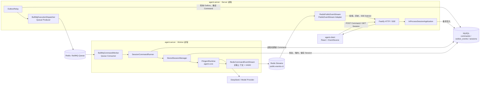

### 3.1 包边界

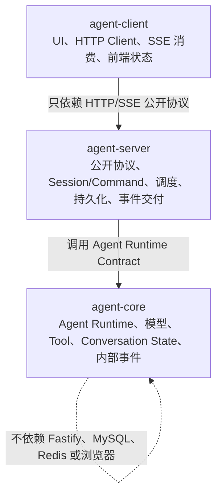

`agent-core` 不读取 Server 的环境变量，也不知道 MySQL、Redis、Fastify 和 SSE。Server/Worker composition root 将模型配置、API Key resolver 和事件回调注入 Core。

---

## 4. 进程及入口函数

### 4.1 Server 进程

启动命令：

```bash
npm run dev:server
```

进程入口：`packages/agent-server/src/start-server.ts`

第一个业务函数：`main()`

职责：

- 读取 `.env` 和 Server 配置。
- 根据 `STORAGE_MODE` 选择内存或数据库装配。
- 数据库模式下启动 Fastify、Outbox Relay、BullMQ Producer 和 Redis Public Event Stream Reader。
- 监听 HTTP 端口。
- 注册 `SIGINT`、`SIGTERM` 优雅关闭。

### 4.2 Worker 进程

启动命令：

```bash
npm run dev:worker
```

进程入口：`packages/agent-server/src/start-worker.ts`

第一个业务函数：`main()`

它不是 HTTP 服务，不监听端口。它是一个由 Redis 连接保持存活的 Node.js 后台消费者进程。

职责：

- 读取 MySQL、Redis、模型和并发配置。
- 创建 Agent RuntimeFactory。
- 启动 BullMQ Worker Consumer。
- 从 MySQL 恢复和保存 Session。
- 调用 Agent Core 执行 Command。
- 将关联 Command 的 Agent 事件追加到有界 Redis Stream。

### 4.3 Client 进程

启动命令：

```bash
npm run dev:client
```

React 入口：`packages/agent-client/src/main.tsx`

主要交互组件：`AgentConsole()`，位于 `packages/agent-client/src/App.tsx`。

HTTP Client：`AgentServerClient`，位于 `packages/agent-client/src/index.ts`。

---

## 5. 动作入口函数总表

| 动作 | 最初触发函数 | Server/Worker 内部起点 | 最终动作 |
| --- | --- | --- | --- |
| 浏览器发送 Prompt | `AgentConsole.sendCommand()` | Fastify `POST /commands` handler | 创建 Command 与 Outbox |
| 浏览器发送 Abort | `AgentConsole.abortRun()` | Fastify `POST /commands` handler | 创建 `abort` Command |
| Client 生成 commandId | `AgentServerClient.submitCommand()` | `crypto.randomUUID()` | 放入 HTTP body |
| Server 启动 | `start-server.ts/main()` | `createApplication()` | Fastify 开始监听 |
| Worker 启动 | `start-worker.ts/main()` | `createWorker()` | BullMQ Worker 开始消费 |
| Command 幂等提交 | `InProcessSessionApplication.submitCommand()` | `createQueuedIfAbsent()` | 首次创建或返回旧 Command |
| MySQL 事务提交 | `MySqlCommandSubmissionStore.createQueuedIfAbsent()` | `beginTransaction()` | 同事务写 `commands` 与 `outbox_events` |
| 唤醒 Outbox | `OutboxRelay.wake()` | `schedule(0)` | 尽快开始轮询 |
| 周期轮询 Outbox | `OutboxRelay.start()` | `schedule()` → `poll()` | claim 待投递事件 |
| 投递 BullMQ | `OutboxRelay.deliver()` | `BullMqExecutionDispatcher.enqueue()` | Redis 创建 Job |
| Worker 接收 Job | BullMQ processor callback | `BullMqCommandWorker.execute()` | 校验 Job 并执行 Command |
| Command 真正执行 | `SessionCommandRunner.executeById()` | `execute()` | 更新状态并调用 SessionManager |
| Prompt 恢复 Session | `StoredSessionManager.prompt()` | `executePrompt()` → `preparePrompt()` | 获取租约并创建 Runtime |
| Agent 执行 Prompt | `PiAgentRuntime.execute()` | `agent.prompt()` | 调用模型和 Tool |
| 续租 | `startLeaseRenewal()` 的 timer callback | `StoredSessionManager.renewLease()` | 更新 `lease_until_ms` |
| 保存 Agent State | `StoredSessionManager.executePrompt()` | `runtime.exportState()` → `saveNext()` | 乐观锁更新 `sessions` |
| Agent 内部事件 | `PiAgentRuntime.publishAgentEvent()` | `convertAgentEvent()` | 形成 `AgentRuntimeEvent` |
| Worker 发布事件 | `PiAgentRuntime` 的 `onEvent` callback | `RedisCommandEventStream.accept()` | `XADD` 追加关联后的事件 |
| Server 接收事件 | `RedisPublicEventStream.ready()` | `XRANGE` 重放后进入 `XREAD BLOCK` | 投影保留事件并持续 tail |
| Server 投影公开事件 | `InMemoryPublicEventStream.accept()` | `DefaultBrowserEventProjector.project()` | 生成公开事件并通知 listener |
| 建立 SSE | `AgentConsole` 的 `useEffect()` | Fastify `GET /event-stream` handler | 注册 `publicEvents.subscribe()` |
| SSE 写出事件 | `PublicEventStream.subscribe()` listener loop | Fastify 注册的 listener | `reply.raw.write()` |
| 查询 Session | `AgentServerClient` 对应 HTTP 请求 | Fastify `GET /sessions/:id` handler | `sessionApplication.getSession()` |
| 查询保留窗口事件 | `AgentServerClient.history()` | Fastify `GET /events` handler | `PublicEventStream.read()` |
| Server 关闭 | signal → `registerShutdownHandlers()` | `app.close()` | Relay、Event Stream、Producer、MySQL 依次关闭 |
| Worker 关闭 | signal → `registerShutdownHandlers()` | `worker.close()` | Consumer、Command Event Stream、MySQL 依次关闭 |

---

## 6. Server 启动执行链

### 6.1 数据库模式启动时序

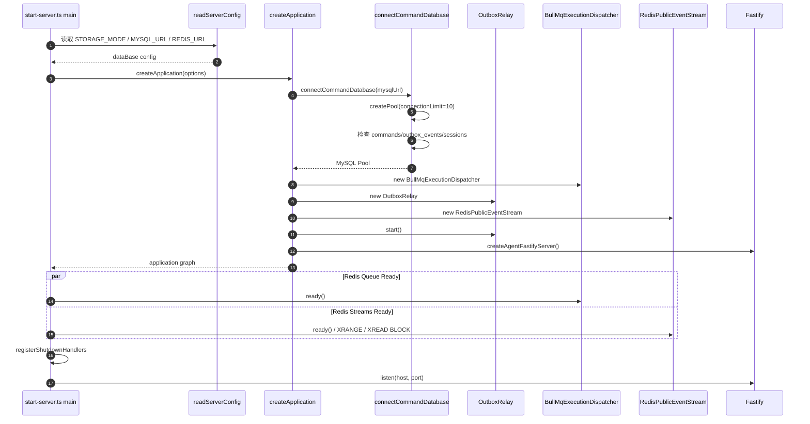

### 6.2 精确函数链

```text
start-server.ts 顶层 await main()
└─ main()
   ├─ readServerConfig()
   ├─ createServerLogger()
   ├─ createPinoExecutionLogger()
   ├─ createApplication()
   │  └─ createStoreApplication()
   │     ├─ connectCommandDatabase()
   │     ├─ new MySqlCommandRepository()
   │     ├─ new MySqlCommandSubmissionStore()
   │     ├─ new StoredSessionQuery(new MySqlSessionStore())
   │     ├─ new BullMqExecutionDispatcher()
   │     ├─ new OutboxRelay()
   │     ├─ new RedisPublicEventStream()
   │     ├─ new InProcessSessionApplication()
   │     ├─ OutboxRelay.start()
   │     └─ createAgentFastifyServer()
   ├─ BullMqExecutionDispatcher.ready()
   ├─ RedisPublicEventStream.ready()
   ├─ registerShutdownHandlers()
   └─ app.listen()
```

数据库模式的 Server 不创建 `PiAgentRuntimeFactory`，也不读取 `DEEPSEEK_API_KEY`。模型执行只属于 Worker。

---

## 7. Worker 启动执行链

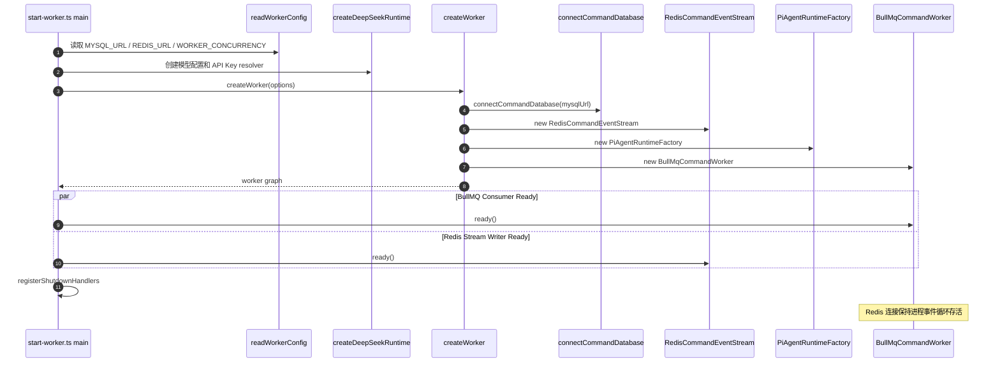

精确函数链：

```text
start-worker.ts 顶层 await main()
└─ main()
   ├─ readWorkerConfig()
   ├─ createDeepSeekRuntime()
   ├─ createWorker()
   │  ├─ connectCommandDatabase()
   │  ├─ new RedisCommandEventStream()
   │  ├─ new PiAgentRuntimeFactory()
   │  ├─ new MySqlCommandRepository()
   │  ├─ new StoredSessionManager()
   │  ├─ new SessionCommandRunner()
   │  └─ new BullMqCommandWorker()
   ├─ worker.ready()
   │  ├─ BullMqCommandWorker.ready()
   │  └─ RedisCommandEventStream.ready()
   └─ registerShutdownHandlers()
```

---

## 8. 数据库模式：Prompt 从提交到完成

### 8.1 完整时序图

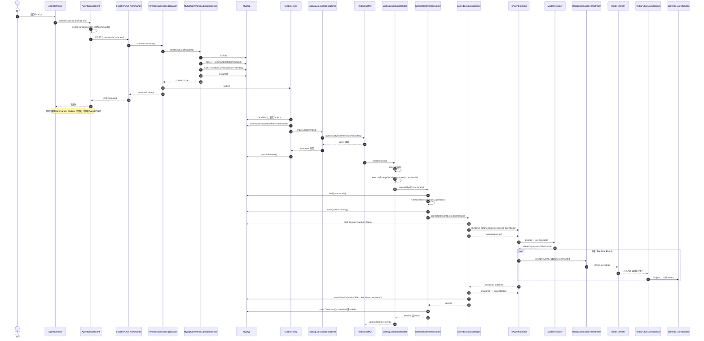

### 8.2 HTTP 接收链：为什么立即返回 202

起点：Fastify 的 `POST /api/v1/sessions/:sessionId/commands` handler。

```text
POST handler
└─ InProcessSessionApplication.submitCommand()
   ├─ 校验非 abort Command 必须有 text
   ├─ MySqlCommandSubmissionStore.createQueuedIfAbsent()
   │  ├─ beginTransaction()
   │  ├─ INSERT commands
   │  ├─ INSERT outbox_events
   │  └─ commit()
   ├─ OutboxRelay.wake()
   └─ 返回 SubmittedCommand
POST handler
└─ reply.code(202).send(PublicCommandReceipt)
```

`202 Accepted` 的精确定义：Server 已可靠接收并持久化 Command，异步执行将在后续发生。

### 8.3 Command 幂等

`commandId` 由 Client 的 `AgentServerClient.submitCommand()` 使用 `crypto.randomUUID()` 创建。Server 并不替 Client 创建 ID。

MySQL 的 `commands.command_id` 是主键。`createQueuedIfAbsent()` 遇到重复键后回滚当前事务，再读取已有 Command：

- `sessionId/type/text` 完全相同：返回原 Command，不创建第二条 Outbox，也不重复执行。
- 内容不同：`InProcessSessionApplication.submitCommand()` 抛出 `CommandConflictError`，HTTP 返回 409。

Outbox 使用稳定 ID `command:${commandId}:queued`；BullMQ Job ID 使用 `commandId` 的 SHA-256。两层稳定 ID 进一步抑制重复投递。

### 8.4 Transactional Outbox

Outbox 解决的问题：不能先写 MySQL 再直接写 Redis，否则两个独立系统之间存在崩溃窗口。

```text
同一个 MySQL 事务
├─ INSERT commands
└─ INSERT outbox_events
```

事务提交后，即使 Server 在 Redis 投递前退出，`outbox_events` 仍保留待办。重启后的 `OutboxRelay` 会继续处理。

`OutboxRelay` 的循环：

```text
start() / wake()
└─ schedule()
   └─ poll()
      └─ MySqlOutboxStore.claimNext()
         ├─ SELECT ... FOR UPDATE
         ├─ status=processing
         ├─ locked_by=leaseId
         └─ locked_until_ms=now+leaseDuration
      └─ deliver()
         ├─ CommandRepository.find()
         ├─ BullMqExecutionDispatcher.enqueue()
         └─ 成功：markPublished()
            失败：reschedule() + 指数退避
```

### 8.5 BullMQ 投递和消费

Producer 起点：`BullMqExecutionDispatcher.enqueue()`。

它只提交以下最小 Job 数据：

```ts
{
  commandId,
  sessionId,
  type
}
```

完整 Command 必须由 Worker 的 `SessionCommandRunner.executeById()` 从 MySQL 重读，避免 Redis 成为业务事实来源。

Consumer 起点不是手写循环，而是 `new Worker(queueName, (job) => this.execute(job), options)` 注册的 BullMQ processor 回调。

`BullMqCommandWorker.execute()` 的规则：

- `prompt`：进入 `executePromptSerially()`，同一 Worker 内同一 Session 串行。
- `steer/follow-up/abort`：直接调用 `commandRunner.executeById()`，不进入 Prompt 串行队列。
- Worker 全局并发由 `WORKER_CONCURRENCY` 控制，默认 4。
- Runner 抛异常：BullMQ Job 失败，按配置指数退避重试。
- Agent 返回业务失败 outcome：Command 标记 `failed`，但 Runner 正常结束，Job 视为 completed，不重复执行 Prompt。

---

## 9. Session 恢复、租约、续租和保存

### 9.1 Prompt 执行时序

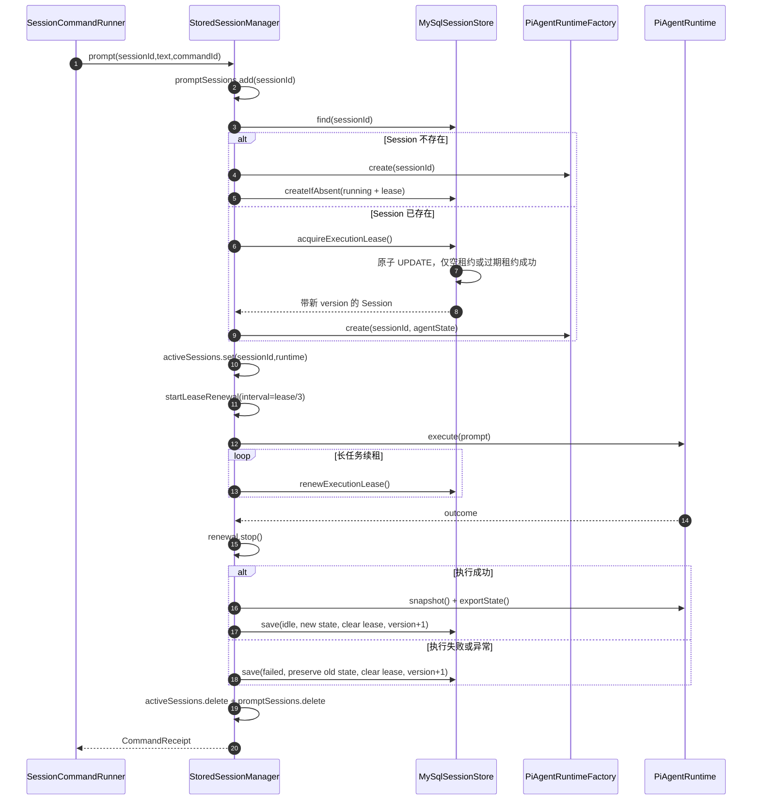

### 9.2 三层并发保护

1. `BullMqCommandWorker.promptExecutions`
   - 作用域：单 Worker 进程。
   - 作用：同一 Session 的 Prompt Job 排队，不同 Session 可并行。

2. `StoredSessionManager.promptSessions`
   - 作用域：单 Worker 进程。
   - 作用：覆盖 MySQL 查询、Runtime 恢复和执行全过程，避免准备阶段重复进入。

3. MySQL Session Execution Lease
   - 作用域：所有 Worker。
   - 作用：通过原子 `UPDATE` 保证同一 Session 同一时刻只能由一个 Worker 执行。

### 9.3 租约字段

| 字段 | 含义 |
| --- | --- |
| `executing_command_id` | 当前占用 Session 的 Command |
| `lease_owner` | 当前 Worker 实例 ID |
| `lease_until_ms` | 租约过期时间 |
| `version` | Session 乐观锁和 fencing 版本 |

`MySqlSessionStore.acquireExecutionLease()` 只有在租约为空或已过期时才能更新成功。获取时同时将 Session 设为 `running`、写入 Command/Worker/过期时间并递增 `version`。

长任务由 `startLeaseRenewal()` 每隔 `leaseDuration / 3` 调用 `renewExecutionLease()`。续租失败意味着 Worker 已失去执行权：Runtime 会收到 abort，旧 Worker 不再允许保存结果。

执行完成后不再续租；保存下一版本 Session 时清除三个租约字段，相当于释放执行权。

### 9.4 activeSessions 的作用

`StoredSessionManager.activeSessions` 保存当前 Worker 内已经恢复且正在运行的 Runtime，用于让 `steer/follow-up/abort` 找到目标 Runtime。

当前限制：控制 Command 由 BullMQ 任意 Worker 消费。如果它没有被分配到持有目标 Runtime 的 Worker，`executeControl()` 会返回 `SESSION_NOT_ACTIVE`。因此跨 Worker 控制命令精确路由属于第二阶段任务。

---

## 10. Agent Core 执行链

起点：`PiAgentRuntime.execute(command)`。

Prompt 链路：

```text
PiAgentRuntime.execute({type: "prompt"})
├─ agent.prompt(text)
├─ agent.waitForIdle()
└─ return executionOutcome
```

Runtime 创建链路：

```text
PiAgentRuntimeFactory.create(sessionId, state?)
├─ restoreConversationMessages(state, modelId)
├─ new Agent({model, messages, tools, systemPrompt, getApiKey})
├─ new PiAgentRuntime(sessionId, agent, messageSequence)
└─ runtime.subscribe(onEvent)
```

Agent Core 当前提供：

- 模型执行。
- `lookupSourceTool`。
- 对话状态恢复和导出。
- Prompt、Steer、Follow-up、Abort。
- 将底层 Agent Event 转换为稳定的 `AgentRuntimeEvent`。

Server 只把 `agent_state` 当作带 `schemaVersion` 的不透明数据保存，不解析 Pi Agent 的内部消息结构。

---

## 11. Worker 事件到浏览器 SSE

### 11.1 写入、重放和实时读取时序

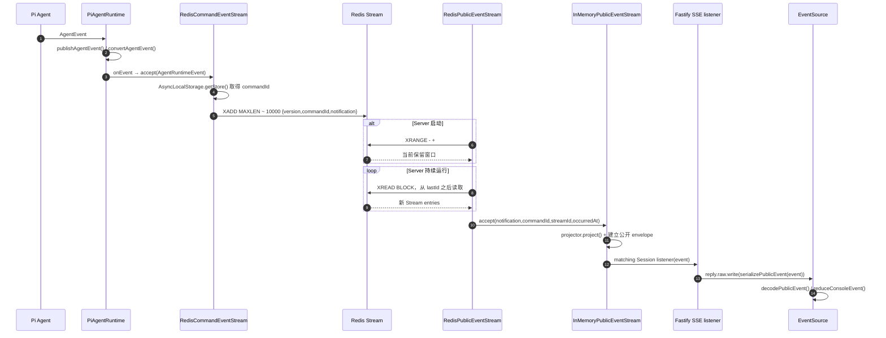

### 11.2 commandId 如何跟随异步事件

Worker 装配 `SessionCommandRunner` 时注入：

```text
runInContext(command, operation)
└─ RedisCommandEventStream.run(
     command.sessionId,
     command.commandId,
     operation
   )
```

`run()` 使用 `AsyncLocalStorage.run()` 建立本次 Command 的异步上下文。Runtime 直接把事件交给同一深模块的 `accept()`；`accept()` 用 `getStore()` 取回正确的 `sessionId/commandId`，校验事件 Session 后执行 `XADD`。

它不是全局变量：多个 Command 并发执行时拥有独立上下文。没有上下文、Session 不匹配或模块已关闭的事件不会写入 Stream。

### 11.3 PublicEventStream seam

Fastify 只依赖统一的 `PublicEventStream` interface：

```text
ready()
read(sessionId)
subscribe(sessionId, listener)
close()
```

两个真实 Adapter：

- `InMemoryPublicEventStream`：内存模式中直接接收 Runtime 事件，同时负责关联、投影、历史和 listener。
- `RedisPublicEventStream`：数据库模式中先通过 `XRANGE` 重放保留窗口，再用 `XREAD BLOCK` 持续读取；内部组合 `InMemoryPublicEventStream` 完成投影和 listener 分发。

公开投影规则仍由 `DefaultBrowserEventProjector` 集中执行：过滤 thinking delta，把文本 `message_delta` 转成 `assistant_delta`，并过滤不允许暴露的消息角色。

### 11.4 SSE 连接从哪里开始

浏览器侧：`AgentConsole()` 的 `useEffect()`。

```text
new EventSource(client.eventStreamUrl(sessionId))
└─ GET /api/v1/sessions/:sessionId/event-stream
```

Server 侧 Fastify handler：

```text
reply.hijack()
├─ writeHead(200, sseHeaders())
├─ write("connected")
├─ publicEvents.subscribe(sessionId, listener)
├─ startHeartbeat(reply.raw)
└─ request close 时 clearInterval + unsubscribe
```

### 11.5 当前事件保证

- Redis Stream 使用 `MAXLEN ~ 10000` 近似裁剪，因此提供的是有界保留窗口，不是永久审计日志。
- Worker 完成 `XADD` 后，Server 短暂离线不会丢失保留窗口内的事件；Server 重启会通过 `XRANGE` 重放。
- Server 通过 Stream ID 生成稳定 `eventId` 和 `occurredAt`；`sequence` 按本实例重放到的每个 Session 事件顺序重新计算。
- `GET /events` 读取 Server 已重放和持续 tail 的投影缓存，不直接在请求时查询 Redis。
- 页面首次挂载或切换 Session 时会并行请求一次 `GET /events`。EventSource 自动重连虽然会携带 `Last-Event-ID`，但当前 Server handler 尚未读取它，也不会在内部重连时再次查询历史，因此断线窗口仍可能暂时缺失，刷新页面后才会从 Server 投影缓存恢复。
- Redis Stream 是事件恢复来源，但 MySQL Command、Session 和 Agent State 仍是业务事实来源。

---

## 12. InMemory 模式执行链

架构：

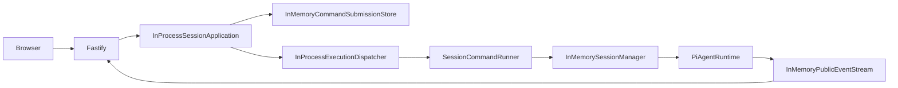

精确链路：

```text
start-server.ts/main()
└─ createApplication({storageMode:"inMemory"})
   └─ createMemoryApplication()
      ├─ new InMemoryPublicEventStream()
      ├─ new PiAgentRuntimeFactory()
      ├─ new InMemorySessionManager()
      ├─ new InMemoryCommandRepository()
      ├─ new InMemoryCommandSubmissionStore()
      ├─ new SessionCommandRunner()
      ├─ new InProcessExecutionDispatcher()
      └─ createAgentFastifyServer()
```

提交 Command 后：

```text
submitCommand()
├─ InMemoryCommandSubmissionStore.createQueuedIfAbsent()
└─ InProcessExecutionDispatcher.enqueue()
   ├─ prompt：进入 pendingPrompts，按 Session 串行和 maxConcurrency 调度
   └─ control：直接 start(commandId)
      └─ SessionCommandRunner.executeById()
         └─ InMemorySessionManager → PiAgentRuntime
```

内存模式没有 MySQL、Outbox、BullMQ、独立 Worker、Session 租约和 Redis Streams。Runtime 事件直接进入 `InMemoryPublicEventStream`，不经过额外 EventBus。它保留完整开发体验，但服务重启后 Command、Session 和事件都会丢失。

---

## 13. 查询链路

### 13.1 查询 Session

HTTP：`GET /api/v1/sessions/:sessionId`

```text
Fastify handler
└─ InProcessSessionApplication.getSession()
   └─ SessionQuery.snapshot()
      ├─ 数据库模式：StoredSessionQuery → MySqlSessionStore.find()
      └─ 内存模式：InMemorySessionManager.snapshot()
```

对外只返回 `idle/running`。内部 `failed` 状态当前会被映射为 `idle`，这是当前 PublicSession contract 的简化语义。

### 13.2 查询事件历史

HTTP：`GET /api/v1/sessions/:sessionId/events`

```text
Fastify handler
└─ PublicEventStream.read(sessionId)
   └─ 返回当前 Adapter 已投影的 Session 事件副本
```

数据库模式在 Server 启动时从 Redis Stream 重放，然后持续 tail；请求本身只读 Server 投影缓存。内存模式只读本进程事件。

---

## 14. 状态变化总览

### 14.1 Command 状态

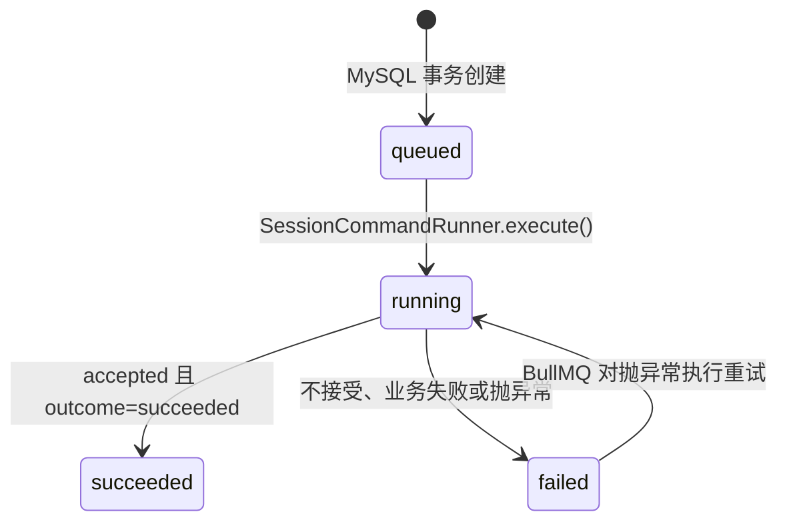

当前数据库提交路径直接创建 `queued`，不会产生 `accepted`；`cancelled` 已保留在类型中，但没有实际迁移入口。模型返回业务失败时 Command 进入 `failed`，BullMQ Job 仍视为已完成，避免自动重复 Prompt。只有 Runner 抛异常导致 Job 重试时，原先保存为 `failed` 的 Command 才会再次进入 `running`。

### 14.2 Outbox 状态

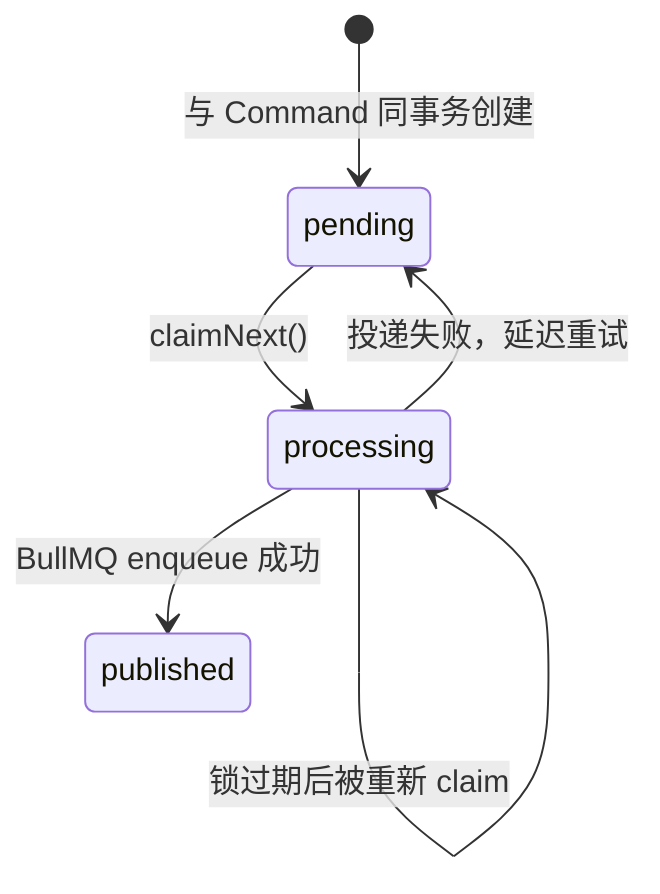

### 14.3 Session 状态

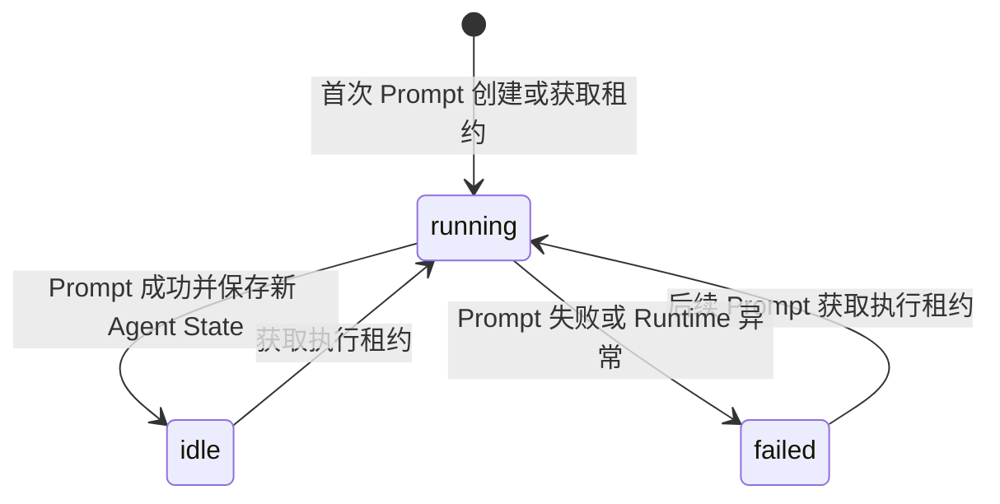

`SessionStatus` 类型和数据表允许 `closed`，但第一版尚未提供关闭 Session 的公开动作，因此上图只画当前代码实际产生的迁移。

### 14.4 BullMQ Job 状态语义

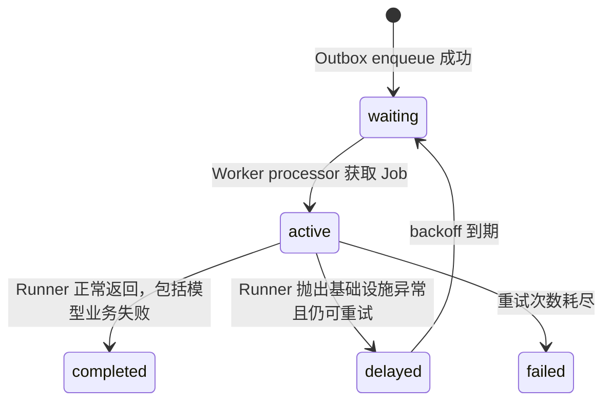

Job 状态不等于 Command 状态。Command 是 MySQL 业务事实；Job 只是 Redis 中的一次执行投递。稳定 `jobId` 防止 Outbox 至少一次投递产生多个业务 Job。

### 14.5 Public Event 状态流

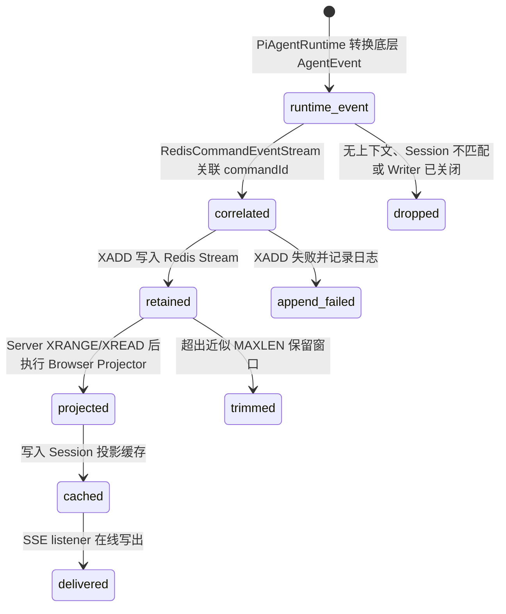

`delivered` 不是持久化确认状态，系统不记录每个浏览器是否消费成功。Redis Stream 保证的是 Server 可在保留窗口内重新读取，不是端到端 exactly-once。

---

## 15. 失败与重试边界

| 故障点 | 当前行为 |
| --- | --- |
| Command INSERT 失败 | MySQL 事务回滚，HTTP 报错 |
| Outbox INSERT 失败 | 同事务回滚，Command 也不存在 |
| HTTP 返回前 Server 退出 | 若事务已提交，Relay 重启后仍可投递；Client 可用相同 commandId 重试 |
| Redis 暂时不可用 | Outbox 保持 pending，Relay 指数退避重试 |
| Worker 未启动 | Job 留在 BullMQ，Worker 启动后消费 |
| Worker 执行基础设施异常 | Runner 抛错，BullMQ 按 attempts/backoff 重试 |
| 模型返回业务失败 | Command 标记 failed，Job completed，不自动重放 Prompt |
| Worker 执行中退出 | BullMQ 可重新投递；Session 租约过期后其他 Worker 才能接管 |
| 旧 Worker 恢复后尝试保存 | Session version/fencing 阻止覆盖新 Worker 状态 |
| Redis Stream `XADD` 失败 | 记录日志；Command/Session 最终状态仍保存，但该运行事件无法重放 |
| Server Stream Reader 断开 | 记录错误并退避重读；恢复后从 `lastId` 继续读取保留窗口 |
| Server 重启 | `XRANGE` 重放当前 Stream 保留窗口，再进入 `XREAD BLOCK` |
| SSE 客户端断线 | EventSource 自动重连，但 Server 尚未处理 `Last-Event-ID`；内部重连不会再次请求历史，刷新页面才会重新调用 `GET /events` |

---

## 16. 优雅关闭链路

### 16.1 Server

起点：操作系统发出 `SIGINT` 或 `SIGTERM`。

```text
registerShutdownHandlers() 注册的 shutdown()
└─ app.close()
   └─ Fastify onClose hook
      ├─ InProcessSessionApplication.close()
      │  └─ closeDependencies()
      │     ├─ beforeClose()
      │     │  ├─ OutboxRelay.close()
      │     │  └─ RedisPublicEventStream.close()
      │     ├─ BullMqExecutionDispatcher.close()
      │     └─ pool.end()
      └─ PublicEventStream.close()
```

### 16.2 Worker

```text
registerShutdownHandlers() 注册的 shutdown()
└─ worker.close()
   ├─ BullMqCommandWorker.close()
   ├─ RedisCommandEventStream.close()
   └─ pool.end()
```

Worker 先关闭 BullMQ Consumer，让进行中的 Job 完成或停止接收新任务；随后等待未完成的 `XADD` settled，再关闭 Redis Stream Writer 和 MySQL Pool。

---

## 17. 第一版的数据表

### 17.1 commands

保存每次客户端动作及执行状态。主键 `command_id` 同时承担幂等键。

关键索引：

- `(session_id, created_at_ms)`：按 Session 查询 Command。
- `(status, updated_at_ms)`：按状态扫描和运维排查。

### 17.2 outbox_events

保存 Command 待投递事实。它不是 Agent 公开事件表。

关键约束：

- 主键 `event_id`。
- `(aggregate_id, event_type)` 唯一，防止同一 Command 重复创建 queued 事件。
- `(status, available_at_ms)` 支持 Relay 扫描。

### 17.3 sessions

保存 Session 元数据、Agent State、乐观锁版本和 Worker 执行租约。

关键索引：

- `(status, updated_at_ms)`：Session 状态查询。
- `(status, lease_until_ms)`：执行租约运维和过期扫描。

---

## 18. 当前明确边界与第二阶段入口

第一版已完成：

- HTTP/SSE v1 公开协议。
- Command 幂等和 MySQL 持久化。
- Transactional Outbox。
- BullMQ Producer 与独立 Worker Consumer。
- Session/Agent State 持久化。
- 多 Worker Session 租约、续租和 fencing。
- Worker → Redis Streams → Server → SSE，并支持保留窗口重放。
- InMemory 本地开发模式。
- Agent Core 与 Server 基础设施解耦。

有意留到后续的能力：

1. 跨 Worker 的 `steer/follow-up/abort` 精确路由。
2. 用户、租户、权限和业务会话数据模型。
3. SSE `Last-Event-ID` 精确断点续传、跨 Server 稳定 sequence 和长期事件归档。
4. 多 Server、多 Worker 的真实部署、滚动重启和压测。
5. 死信队列、队列监控、指标和告警完善。

第一版的可靠性边界是：Command 和 Session 是 MySQL 中的可靠业务状态；公开事件在 Redis Stream 的有界窗口内可恢复，但不是永久审计数据，且 `XADD` 失败不会回滚 Agent 执行结果。

---

## 19. 阅读代码的推荐顺序

若要从代码中重新走一遍主链，建议按以下顺序阅读：

1. `packages/agent-server/src/start-server.ts`
2. `packages/agent-server/src/bootstrap.ts`
3. `packages/agent-server/src/consumer/fastify-app.ts`
4. `packages/agent-server/src/session/session-application.ts`
5. `packages/agent-server/src/session/mysql/mysql-command-submission-store.ts`
6. `packages/agent-server/src/session/outbox-relay.ts`
7. `packages/agent-server/src/session/redis/bullmq-execution-dispatcher.ts`
8. `packages/agent-server/src/start-worker.ts`
9. `packages/agent-server/src/bootstrap-worker.ts`
10. `packages/agent-server/src/session/redis/bullmq-command-worker.ts`
11. `packages/agent-server/src/session/command-runner.ts`
12. `packages/agent-server/src/session/mysql/stored-session-manager.ts`
13. `packages/agent-server/src/session/mysql/mysql-session-store.ts`
14. `packages/agent-core/src/runtime/pi-agent-runtime.ts`
15. `packages/agent-server/src/session/redis/redis-command-event-stream.ts`
16. `packages/agent-server/src/session/redis/public-event-envelope.ts`
17. `packages/agent-server/src/consumer/public-event-stream.ts`
18. `packages/agent-server/src/consumer/redis-public-event-stream.ts`

这条阅读顺序与真实的“请求进入 → 可靠投递 → Worker 执行 → 状态保存 → 事件返回”顺序一致。
